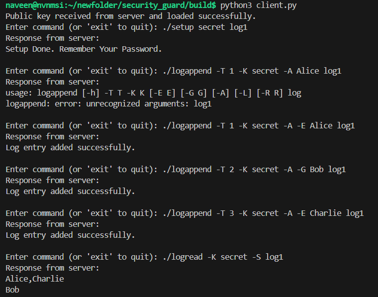
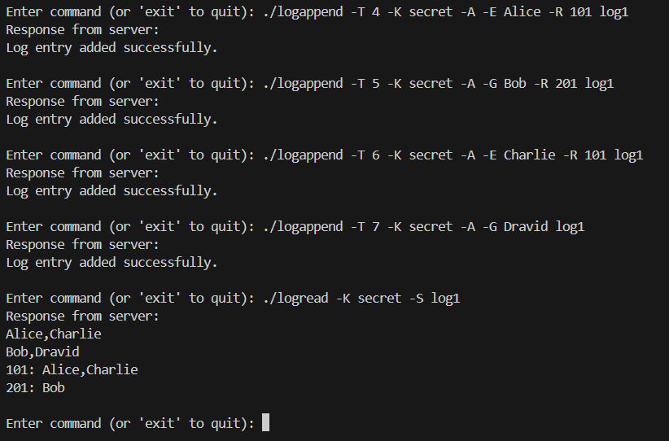
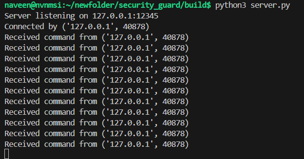

# How to Run?

### Install requirements mentioned in the requirements.txt file. (Better to run in a virtual environment)

### Now go to the build directory.

### If not build already, run 'make build' first.

### Run " python3 server.py ip_add port_no " in the server machine.
(Use your server ip and port no., If not provided default ip and port will be used. Default ip: 127.0.0.1, Default port: 12345)

### Run " python3 client.py ip_add port_no " in the client machine to connect to the server.
(Default ip: 127.0.0.1, Default port: 12345) (Clients only need the client.py file in their machines.)

### After Connection, Clients can execute the commands from their machine.

#### (First Command) Do the setup:
```bash
./setup <your_password> <logfilename>
```
(Logfile file names such as dot dot dot (...) or slash slash slash (///) without any other alphanumeric characters are not allowed.)

#### Now you can read and write entries in the logfile using your password.

#### Possible Commands:

```bash
./logappend -T <timestamp> -K <password> -A/-L -E <employee_name> logfile_name
./logappend -B batchfile_name
./logread -K <password> -S logfile_name
./logread -K <password> -T (-E <name> | -G <name>) logfile_name
./logread -K <password> -R (-E <name> | -G <name>) logfile_name
./logread -K <token> -I (-E <name> | -G <name>) [(-E <name> | -G <name>) ...] logfile_name
```

#### Some Examples:

```bash
./logappend -T 1 -K secret -A -E Alice log1
./logread -K secret -S log1
./logread -K secret -T -E John log1
./logread -K secret -R -E John log1
./logread -K secret -I -E John -G James log1
```

#### Available Flags:

logappend
```
    -T: Timestamp (required)
    -K: Password (required)
    -A/-L: Arrival or Departure
    -E/-G: Employee or Guest
    -R: Room ID (optional)
    -B: Batch file with commands (optional)
```
logread
```
    -K: Password (required)
    -S: Show campus state
    -R: List rooms visited
    -T: Calculate time spent
    -I: Shared room number
```

## Screenshots
#### client side:


#### server side:

